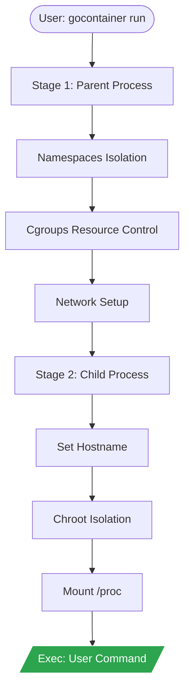

# gocontainerruntime

> A minimal container runtime (study purposes) implemented in Go using Linux namespaces and cgroups


---

`gocontainerruntime` is a lightweight, educational container runtime that demonstrates how modern containers work under the hood. It implements process isolation using Linux Namespaces, resource control via Cgroups, and filesystem isolation using Chroot.

## Demonstration

```bash
# Pull Alpine rootfs
sudo ./gocontainer pull

# Run an isolated shell (Requires sudo for namespaces/cgroups)
sudo ./gocontainer run /bin/sh
```

## Technology Stack

| Technology | Role |
|---|---|
| Go 1.25.0 | Core language and syscalls |
| Linux Syscalls | Namespaces (CLONE_NEWNS, CLONE_NEWUTS, CLONE_NEWPID, CLONE_NEWNET) |
| Cgroups v1 | Resource limits (100MB Memory, 512 CPU shares) |
| Cobra | CLI Framework |
| Alpine Linux | Lightweight rootfs for the container |

## Prerequisites

- Go >= 1.22
- Linux Kernel >= 4.x (with support for namespaces and cgroups v1)
- Root Privileges (required for namespace and network manipulation)

## Installation and Usage

### As a binary

```bash
go install github.com/ESousa97/gocontainerruntime@latest
```

### From source

```bash
git clone https://github.com/ESousa97/gocontainerruntime.git
cd gocontainerruntime
make build
# Optional: Pull default rootfs
make pull
# Run shell
make run
```

## Makefile Targets

| Target | Description |
|---|---|
| `build` | Compiles the `gocontainer` binary |
| `clean` | Removes binary and cache files |
| `test` | Executes the unit test suite |
| `pull` | Downloads and extracts the Alpine Linux minirootfs |
| `run` | Starts an interactive container with `/bin/sh` (requires sudo) |

## Architecture

The runtime operates in two main stages to ensure complete isolation:

<div align="center">



</div>

1. **Stage 1 (Parent)**: Creates new namespaces (UTS, PID, NS, NET), generates memory/CPU cgroups, and re-executes itself by calling the internal `child` command.
2. **Stage 2 (Child)**: Already inside the namespaces, sets the hostname (`gocontainer`), performs the `chroot` to the rootfs, mounts `/proc`, and executes the user's final command.

See more details in [docs/architecture.md](docs/architecture.md).

## API Reference

Detailed documentation for internal functions and packages is available at:
[pkg.go.dev/github.com/ESousa97/gocontainerruntime](https://pkg.go.dev/github.com/ESousa97/gocontainerruntime)

## Configuration

| Variable | Description | Type | Default |
|---|---|---|---|
| `cacheDir` | Directory for rootfs extraction | String | `./cache/alpine_rootfs` |
| `alpineURL` | Alpine download URL | String | Alpine 3.19.1 Minirootfs |

## Roadmap (Finished)

- [x] **Phase 1: Isolated Fork (Namespaces)**: Creation of PID, UTS, and Mount namespaces with re-exec.
- [x] **Phase 2: File Isolation (Chroot)**: Isolation of the system root and mounting of `/proc`.
- [x] **Phase 3: Resource Control (Cgroups)**: Memory limitation (100MB) and CPU shares.
- [x] **Phase 4: Basic Networking (Netns)**: Configuration of veth pairs and static IPs.
- [x] **Phase 5: Professional Interface and Images**: Full CLI with Cobra and Alpine rootfs download.

## Contributing

See [CONTRIBUTING.md](CONTRIBUTING.md) to learn how to participate in the project.

## License

Distributed under the MIT License. See [LICENSE](LICENSE) for more information.

## Author

**Enoque Sousa**
- [Portfolio](https://enoquesousa.vercel.app)
- [GitHub](https://github.com/ESousa97)
